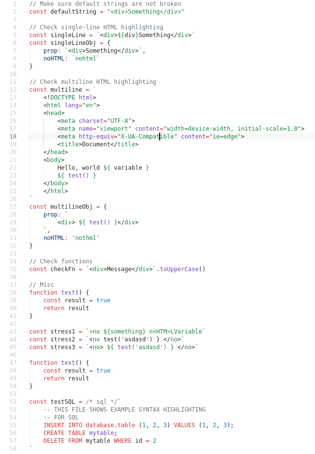

# ES6 String HTML 
> [VSCode Marketplace](https://marketplace.visualstudio.com/items?itemName=Tobermory.es6-string-html)

Adds syntax highlight support for code, placed in es6 multiline strings:
- HTML
- SQL

## Installation

- Install `es6-string-html` from extensions (`ctrl + shift + x`)

## Example

## Usage

Simply insert the comment /\*html\*/ or `html` (or sql instead of html) before the string
(see Requirements "section" for possible values) or select
`Insert es6-string-html comment/template` from the commands menu
(`ctrl+shift+p` or `f1`)

> Tip: Comment in the beginning of es6 string is required

## Requirements

- Visual Studio Code v1.19.0 recommended
- Comment `/*html*/` before the string. Possible values:
- - `/*html*/`
- - `/*inline-html*/`
- - `/*template*/`
- - `/*inline-template*/`
- Or
- - `html` before the string

## Keybindings
- `ctrl+shift+h` - Insert `/*html*/`
- `ctrl+k h` - Insert `/*html*/` \`\`

## Donation

If this project help you reduce time to develop, you can give me a cup of coffee :)

## Release Notes

### [1.0.0] - 2018-02-02
- Syntax highlighting for html in es6 multiline strings

### [1.1.0] - 2018-03-08
- Compatibility with Prettier

### [1.2.0] - 2018-03-12
- Commands and keybindings

### [1.3.0] - 2018-03-17
- Syntax highlight without a comment
- Follow semver

### [1.4.0] - 2018-03-22
- JS Syntax highlight
- Single-line comment support

### [1.5.0] - 2018-03-22
- Compatibility with Prettier

### [1.6.0] - 2018-08-13
- Add SQL support. Beta

### [1.6.0] - 2018-08-13
- Improve support for html function

### [1.7.0] - 2018-08-14
- Improve html function support

### [1.7.1] - 2018-08-15
- Improve single-line comments support
- Disable hotkeys
-----------------------------------------------------------------------------------------------------------

**Enjoy!**
