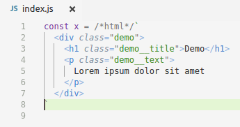

# es6-string-html

Adds syntax highlight support for html placed in es6 multiline strings

## Installation

- Install `es6-string-html` from extensions (`ctrl + shift + x`)

## Example

## Usage

Simply insert the comment /*html*/ (see Requirements "section" for possible values)
or select `Insert es6-string-html comment/template` from the commands menu
(`ctrl+shift+p` or `f1`)

> Tip: Comment in the beginning of es6 string is required

## Requirements

- Visual Studio Code v1.19.0 recommended
- Comment `/*html*/` before the string. Possible values:
- - `/*html*/`
- - `/*inline-html*/`
- - `/*template*/`
- - `/*inline-template*/`

## Keybindings
- `ctrl+shift+h` - Insert `/*html*/`
- `ctrl+k h` - Insert `/*html*/` \`\`

## Donation

If this project help you reduce time to develop, you can give me a cup of coffee :)

## Release Notes

### 1.0.0

Initial release. Simple syntax highlight

### 1.0.1

Compatibility with prettier

### 1.0.2

Commands and keybindings

-----------------------------------------------------------------------------------------------------------

**Enjoy!**
