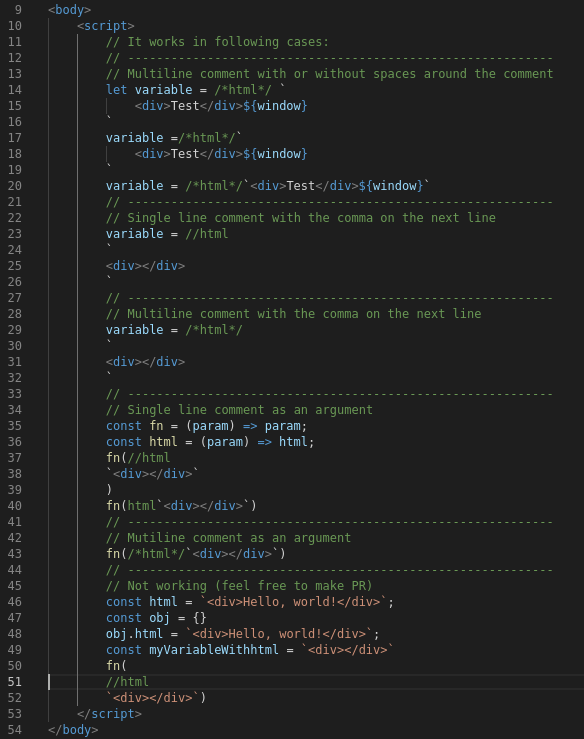

# ES6 String HTML 
> [VSCode Marketplace](https://marketplace.visualstudio.com/items?itemName=Tobermory.es6-string-html)
> [Open VSX Registry](https://open-vsx.org/extension/Tobermory/es6-string-html)

Adds syntax highlight support for code, placed in es6 multiline strings:
- HTML (incl. html quoted and unquoted attrs)
- SQL
- XML
- SVG

## Community
- [es6-string-css](https://github.com/bashmish/es6-string-css) - Highlight CSS in ES6 template literals
- [python-string-sql](https://github.com/ptweir/python-string-sql) - Highlight SQL code in python multiline strings
- [es6-string-javascript](https://github.com/Zjcompt/es6-string-javascript) - Highlight JS in multiline strings

## Installation

- Install `es6-string-html` from extensions (`ctrl + shift + x`)

## Donation

If this project help you reduce time to develop, you can give me a cup of coffee :)

## Example

## Usage

Simply insert the comment /\*html\*/ or `html` (also works with SQL, SVG, XML, just use the appropriate word) before the string
(see Requirements "section" for possible values) or select
`Insert es6-string-html comment/template` from the commands menu
(`ctrl+shift+p` or `f1`)

> Tip: Comment in the beginning of es6 string is required

## Requirements

- Visual Studio Code v1.19.0 and higher
- Comment `/*html*/` before the string. (also works with SQL, SVG, XML, just use the appropriate word) Possible values:
- - `/*html*/`
- - `/*inline-html*/`
- - `/*template*/`
- - `/*inline-template*/`
- Or
- - `html` before the string

## Release Notes

### [...]
- See changelog for previous notes

### [2.5.0] - 2021-04-23
- Ignore casing

### [2.6.0] - 2021-04-23
- Syntax highlighting breaks with multiple placeholders in the same attribute
- Support SVG

### [2.7.0] - 2021-04-23
## Fixed
- SQL highlight stops after encountering an identifier delimiter `
-----------------------------------------------------------------------------------------------------------

**Enjoy!**
